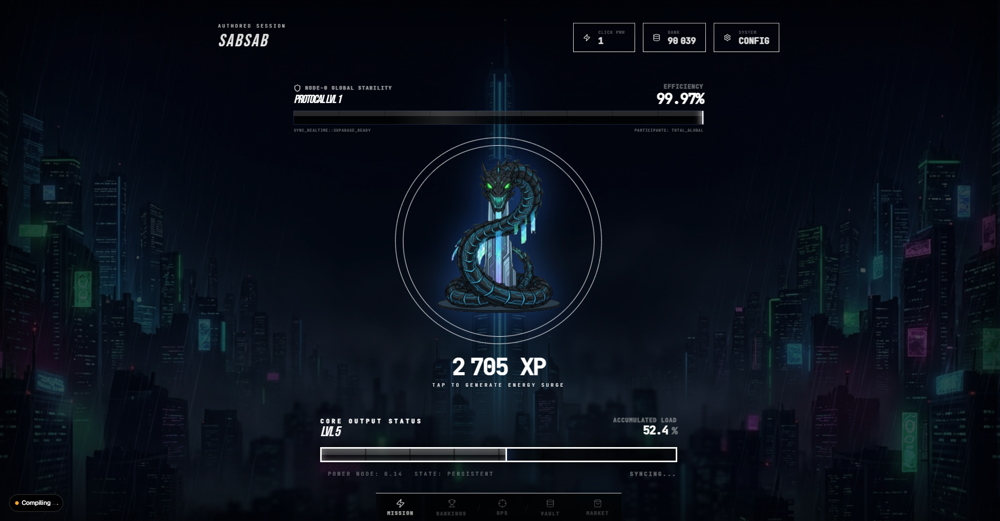
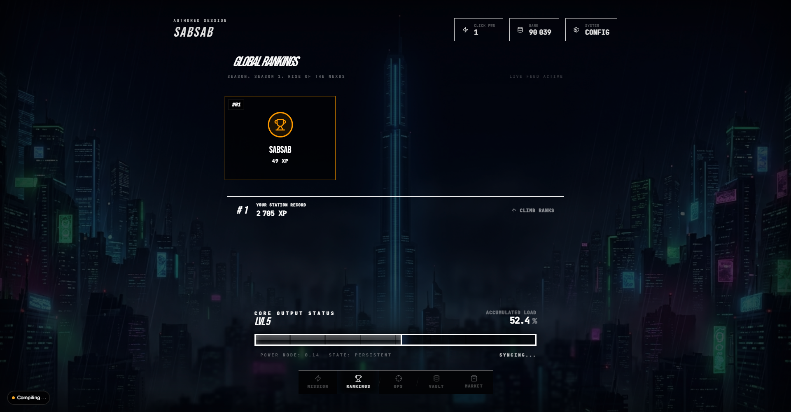
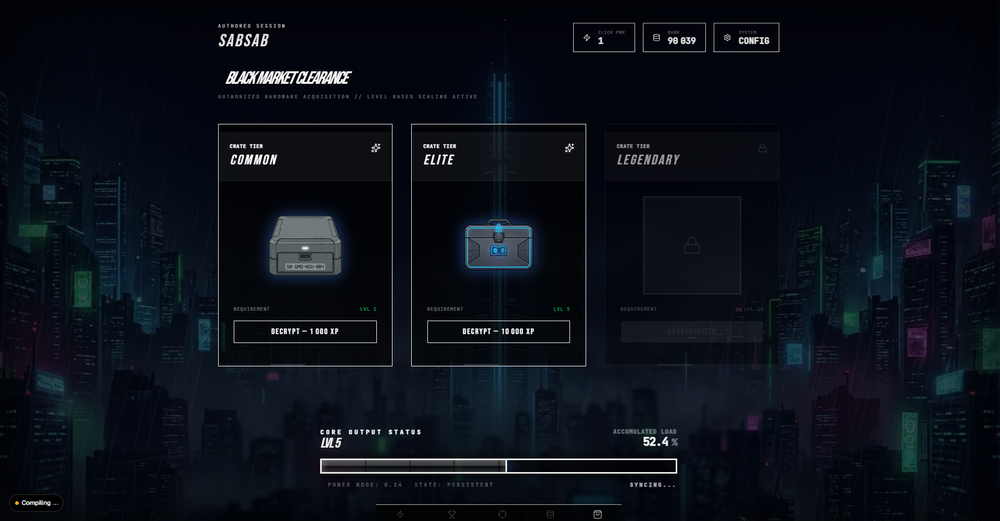

# ⚡ NEXUS CITY

> *A gritty, neon-lit superhero metropolis idle clicker game.*

Nexus City is a prestige idle clicker game set in a sprawling cyberpunk metropolis. Click to generate energy surges, level up your operator profile, open encrypted crates from the Black Market, and compete for dominance on the Global Stability Rankings. Season-based competition, real-time world boss raids, and a deep collectible system keep the grind alive.

---

## 🎮 Core Gameplay

| Feature | Description |
|---|---|
| **Click-to-Earn** | Every tap generates XP raw energy that powers your level progression |
| **Dual Economy** | **Career XP** (lifetime, ranking) vs **Bank** (spendable, fluctuates with purchases) |
| **Black Market** | Spend Bank XP to decrypt Common, Elite, and Legendary crates |
| **Storage Vault** | Collect 20 unique cyberpunk artifacts across 5 rarity tiers |
| **World Boss** | Server-wide raid — all players combine damage to destabilize NODE-0 |
| **Global Rankings** | Seasonal leaderboard ranked by total Career XP |
| **Daily Operations** | Rotating mission objectives with XP bounties |
| **Offline Earnings** | Your passive rate keeps generating income while you're away |

---

## 🗃️ Collectible Rarity System

| Tier | Color | Examples |
|---|---|---|
| ⚪ **Common** | Gray | Static Datapad, Volt-Tape, Sector Badge |
| 🟢 **Uncommon** | Green | Neon Tanto, Scan-Line Visor, Signal Jammer |
| 🔵 **Rare** | Blue | Void Dagger, Overclocked Net-Deck, Arc-Thrower |
| 🟣 **Epic** | Purple | Phantom Mask, Dragon Lantern, Neural Relic |
| 🟡 **Legendary** | Gold | Nexus Core, Celestial Vandal, The Overseer's Eye |

---

## 📸 Screenshots


*Mission Control — Click HUD & World Boss*


*Global Rankings — Season Leaderboard*


*Storage Vault — Collectible Grid*

---

## 🛠️ Tech Stack

| Layer | Technology |
|---|---|
| **Framework** | Next.js 14+ (App Router) |
| **Language** | TypeScript |
| **Database** | Supabase (PostgreSQL) + Drizzle ORM |
| **Auth** | Supabase Auth |
| **State** | Zustand (local) + TanStack Query v5 (server) |
| **Realtime** | Supabase Realtime (World Boss, Leaderboard) |
| **Animation** | Framer Motion v12 |
| **Audio** | Howler.js |
| **Styling** | Tailwind CSS v4 + Shadcn/UI |
| **Rate Limiting** | Upstash Redis |

---

## 🚀 Getting Started

### Prerequisites
- Node.js 18+
- A [Supabase](https://supabase.com) project
- An [Upstash](https://upstash.com) Redis database

### Installation

```bash
git clone https://github.com/your-org/nexus-city
cd nexus-city
pnpm install
```

### Environment Variables

Create a `.env.local` file at the root:

```env
DATABASE_URL=postgresql://...
NEXT_PUBLIC_SUPABASE_URL=https://xxx.supabase.co
NEXT_PUBLIC_SUPABASE_ANON_KEY=eyJ...
UPSTASH_REDIS_REST_URL=https://...
UPSTASH_REDIS_REST_TOKEN=...
```

### Database Setup

```bash
# Push the schema to your Supabase database
pnpm db:push

# Seed with items, chest tiers, quests, and world boss
pnpm db:seed
```

### Run the Dev Server

```bash
pnpm dev
```

Open [http://localhost:3000](http://localhost:3000) to enter the city.

---

## 📁 Key Directories

```
/
├── app/               # App Router pages and layouts
├── actions/           # Server Actions (XP sync, chests, quests, leaderboard)
├── components/
│   ├── game/          # Core clicker HUD (XpBar, HeroClickTarget, GlobalStabilityBar)
│   ├── chest/         # Crate reveal dialog
│   ├── inventory/     # Storage Vault collectible grid
│   └── leaderboard/   # Season rankings table
├── db/
│   ├── schema/        # Drizzle table definitions
│   ├── seed.ts        # Database seeder
│   └── client.ts      # Drizzle singleton
├── hooks/             # useXpSync, useInventory, useLeaderboard, useWorldBoss
├── lib/
│   ├── game/          # Formulas, Loot tables, Anti-cheat
│   └── sound/         # SoundManager (Howler)
├── store/             # Zustand game state (gameStore.ts)
└── public/
    ├── bg/            # Background city assets
    ├── chests/        # Chest PNG assets
    ├── items/         # 20 collectible item PNGs
    └── particles/     # Click spark animation frames
```

---

## 🔐 Anti-Cheat & Security

- All XP mutations are **server-authoritative** via Next.js Server Actions
- Click bursts are validated against a theoretical max based on elapsed time and click power
- Every action calls `supabase.auth.getUser()` for session verification
- Chest rolls are executed server-side — never on the client
- Rate limiting applied via Upstash Redis on critical endpoints

---

## 📜 License

Private — All rights reserved.
